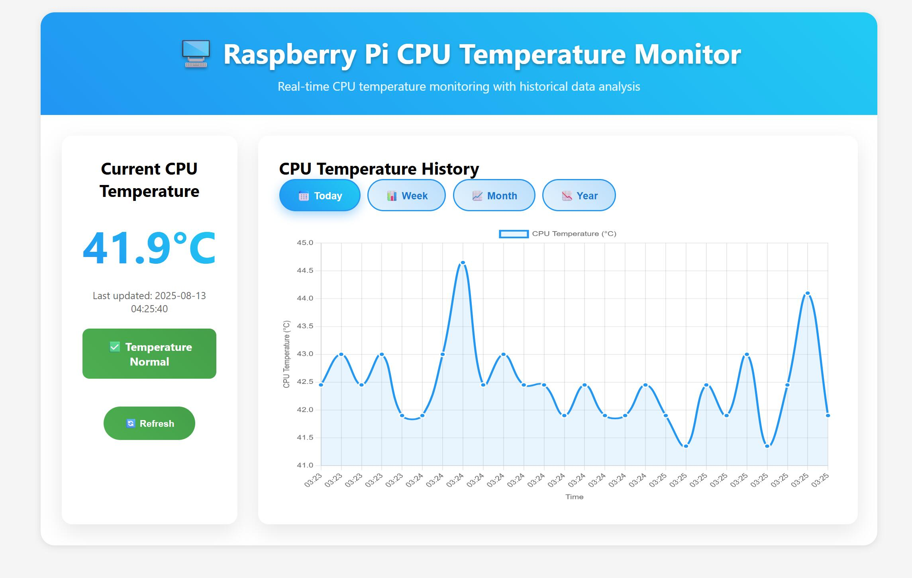

# Pi Temperature Monitor



A modern web application for monitoring Raspberry Pi CPU temperature with real-time charts, historical data analysis, and a beautiful responsive interface.

## Features

- **📊 Interactive Charts** - Beautiful Chart.js visualizations with smooth animations
- **⏱️ Time Period Analysis** - View temperature data across different time periods:
  - **Today** - 5-minute intervals for detailed monitoring
  - **Week** - Hourly averages for weekly trends
  - **Month** - Daily averages for monthly patterns
  - **Year** - Monthly averages for yearly overview
- **🗄️ SQLite Database** - Persistent temperature data storage with optimized queries
- **🌡️ Real-time Monitoring** - Live temperature updates every 5 seconds
- **🎨 Modern UI** - Responsive design with gradients, animations, and Material Design elements
- **🚨 Status Indicators** - Visual alerts for temperature ranges:
  - Normal: < 60°C (green)
  - Warning: 60-75°C (yellow) 
  - Critical: > 75°C (red)
- **📱 Mobile Responsive** - Works perfectly on desktop, tablet, and mobile devices
- **⚡ Smart Detection** - Auto-detects Raspberry Pi thermal sensors with fallback support

## Requirements

- **Raspberry Pi** (or any Linux system)
- **Go 1.18+** (auto-installed by deploy script if missing)
- **systemd** (for service management)
- Access to `/sys/class/thermal/thermal_zone0/temp` (standard on Raspberry Pi)

## Quick Installation

### One-Command Installation (Recommended)

Install PiHeat directly from the latest release with automatic architecture detection:

```bash
curl -sSL https://gist.githubusercontent.com/Xbeninni/758f885a3df2796f534a3b3f833f3e3b/raw/install.sh | bash
```

This command will:
- Auto-detect your ARM architecture (ARM64 or ARM32)
- Download the latest release binary from GitHub
- Install as a system-wide service that persists after logout
- Create management scripts for easy service control

### Manual Deployment

If you prefer to clone the repository:

```bash
# Clone the repository
git clone https://github.com/Xbeninni/piheat.git
cd piheat

# Deploy as system service (requires sudo)
sudo ./deploy.sh
```

### Manual Installation

```bash
# Build the application
go build -o piheat main.go

# Run directly
./piheat
```

## Usage

1. **Access the Web Interface:**
   ```
   http://localhost:8082
   ```

2. **Dashboard Features:**
   - **Current Temperature** - Real-time display with status indicators
   - **Interactive Charts** - Click time period buttons (Today/Week/Month/Year)
   - **Auto-refresh** - Updates every 5 seconds
   - **Responsive Design** - Works on all devices

3. **Service Management** (system-wide service):
   ```bash
   sudo ./start.sh    # Start the service
   sudo ./stop.sh     # Stop the service  
   sudo ./status.sh   # Check service status
   sudo ./logs.sh     # View live logs
   
   # Or use systemctl directly:
   sudo systemctl start piheat.service
   sudo systemctl stop piheat.service
   sudo systemctl status piheat.service
   ```

## API Endpoints

### GET /
- Returns the web dashboard interface

### GET /api/temperature
- Returns current temperature reading
- Response format:
  ```json
  {
    "temperature": 45.2,
    "timestamp": "2024-01-15 14:30:25"
  }
  ```

### GET /api/chart-data?period={period}
- Returns historical temperature data for charts
- Parameters:
  - `period`: `day`, `week`, `month`, or `year`
- Response format:
  ```json
  [
    {
      "temperature": 45.2,
      "timestamp": "14:30",
      "unixTime": 1642267825
    }
  ]
  ```

## Architecture

- **Backend**: Go with SQLite database
- **Frontend**: Vanilla JavaScript with Chart.js
- **Database**: SQLite with indexed temperature readings
- **Service**: systemd service with auto-restart
- **Security**: Hardened systemd configuration

## Configuration

- **Port**: 8082 (modify in `main.go` if needed)
- **Database**: `temperature.db` (created automatically)
- **Data Retention**: Unlimited (manually clean if needed)

## Temperature Thresholds

- **🟢 Normal**: < 60°C - Optimal operating range
- **🟡 Warning**: 60-75°C - Consider improving cooling
- **🔴 Critical**: > 75°C - Risk of thermal throttling

## Troubleshooting

### Common Issues

- **Permission denied**: Ensure read access to `/sys/class/thermal/thermal_zone0/temp`
- **File not found**: Verify you're on a Raspberry Pi or the app will use simulated data
- **Port in use**: Change port in `main.go` if 8082 is occupied
- **Service won't start**: Check logs with `./logs.sh` or `journalctl -u piheat.service`

### Development

```bash
# Test the application locally
go run main.go

# Build for different architectures
GOOS=linux GOARCH=arm64 go build -o piheat-arm64 main.go
GOOS=linux GOARCH=amd64 go build -o piheat main.go
```

## Contributing

1. Fork the repository
2. Create a feature branch
3. Make your changes
4. Test thoroughly
5. Submit a pull request

## License

This project is open source and available under the MIT License.